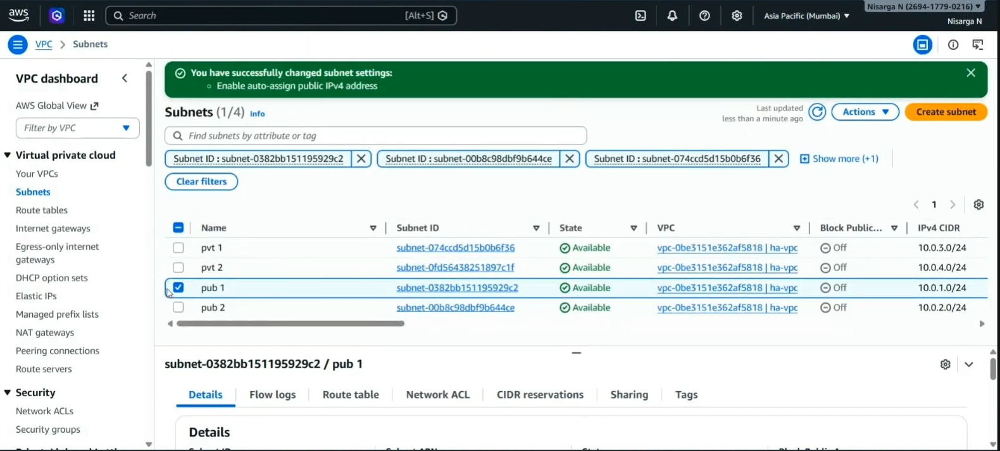
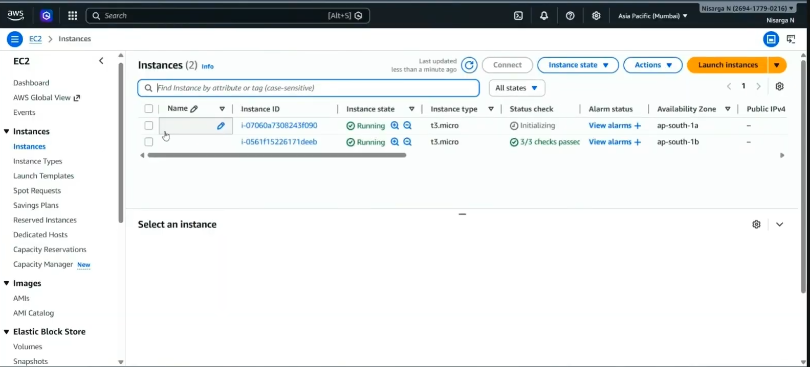
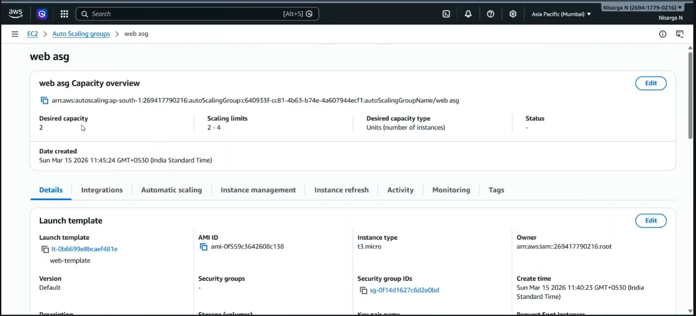
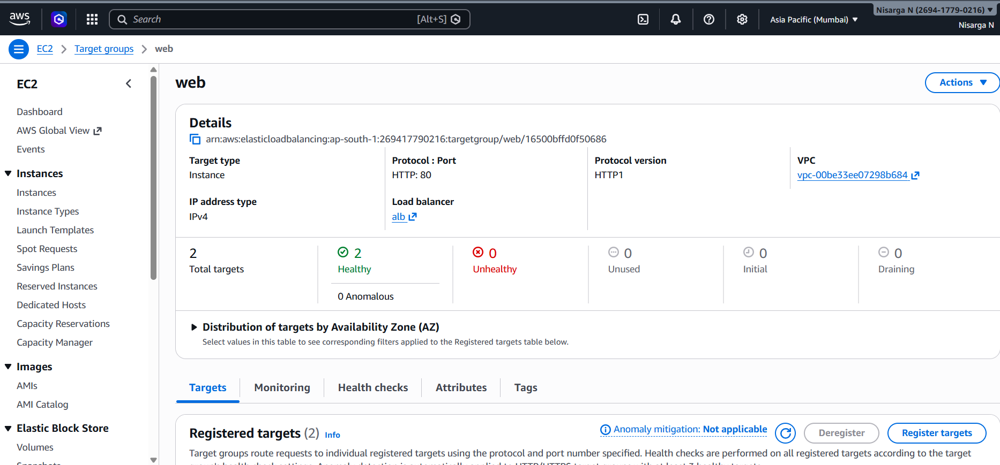
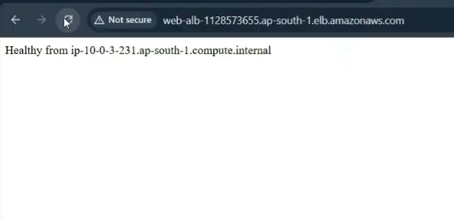
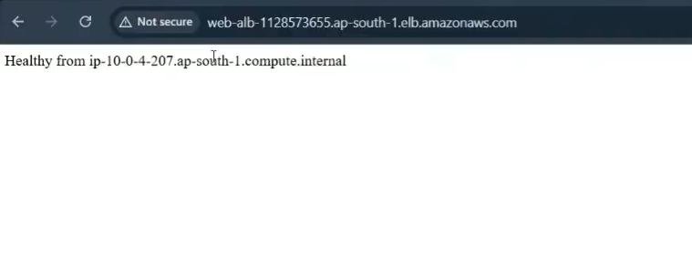

# AWS Highly Available Web Application
🔗 GitHub Project demonstrating Load Balancing and Auto Scaling on AWS

## Project Overview
Built and deployed a scalable web application using AWS services. The application is designed to handle traffic using load balancing and automatic scaling across multiple instances.

## Services Used
- Amazon EC2
- Application Load Balancer (ALB)
- Auto Scaling Group (ASG)
- VPC and Subnets

## Architecture
- Created a VPC with public subnets
- Deployed EC2 instances using Auto Scaling Group
- Configured Application Load Balancer to distribute traffic
- Attached instances to target group with health checks
- Installed Apache web server on EC2 instances

## Steps Performed
1. Created VPC and subnets
2. Launched EC2 instances
3. Installed and configured Apache server
4. Created target group and registered instances
5. Configured Application Load Balancer
6. Set up Auto Scaling Group
7. Verified load balancing using ALB DNS

## Screenshots

### VPC and Subnets

### EC2 Instances

### Auto Scaling Group

### Target Group Health Check

### Load Balancer Output (Instance 1)

### Load Balancer Output (Instance 2)

## Result
- Successfully deployed a scalable web application
- Traffic distributed across multiple EC2 instances
- Verified load balancing using different instance responses
- Health checks confirmed instances are active

## Key Learnings
- Understanding of load balancing and scaling
- Hands-on experience with AWS services
- Configuring EC2 and web servers
- Working with cloud networking basics
